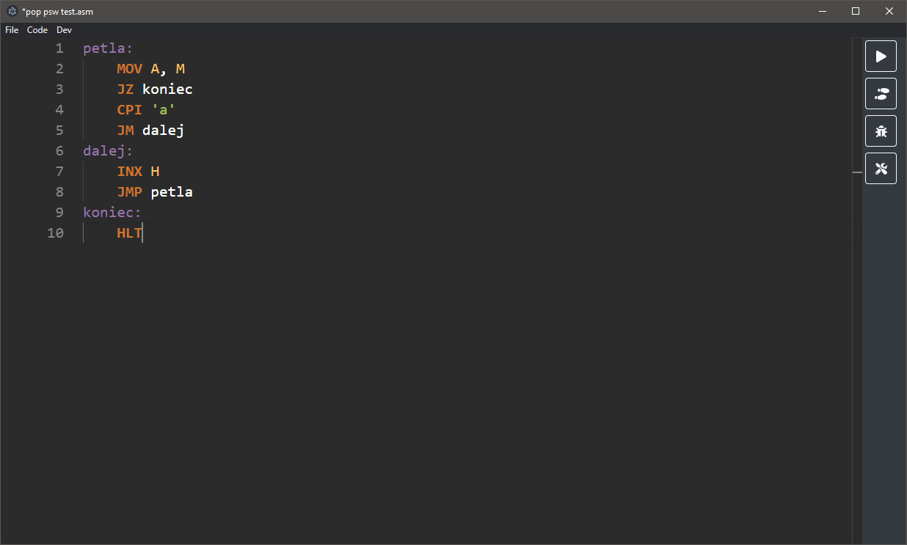
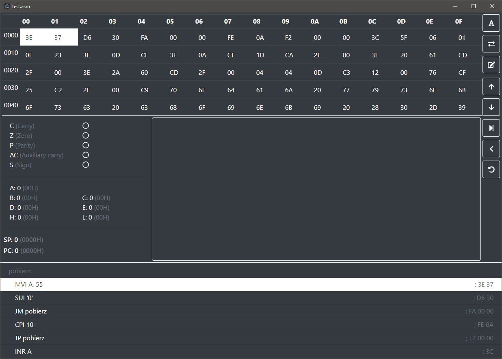

# Intel 8080 CPU assembler and simulator

You can either download the realase or build the program yourself

```bash
git clone https://github.com/mac501pl/8BitSimulator
cd 8BitSimulator
npm install
npm run prod
npm start
```

The assembler supports the following directives: ORG, EQU, SET, DB, DW, DS, MACRO, ENDM

Example program:
```
LXI H, STRING
TRAVERSE:
MOV A, M
CPI ' '
CZ ADD_SPACE
INX H
CPI '@'
JNZ TRAVERSE
INR B
LXI H, RESULT_LOCATION
RST 3
MOV A, B
RST 4
HLT
ADD_SPACE:
INR B
RET
STRING: DB 'ALA MA KOTA@'
RESULT_LOCATION: DB 'WORD COUNT: @'
```

Screenshots:


